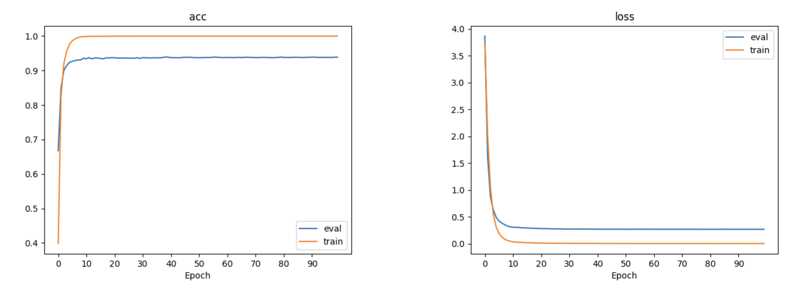

# Homework 1 ADL NTU 109 Spring

## Training
### Environment
```shell
# If you have conda, we recommend you to build a conda environment called "adl"
make
# otherwise
pip install -r requirements.txt
```

### Preprocessing
```shell
# To preprocess intent detectiona and slot tagging datasets
bash preprocess.sh
```

### Intent detection
```shell
python train_intent.py
```
### Slot Tagging
```shell
python train_slot.py
```

## Inference
```shell
bash ./download.sh ./download.zip
bash ./intent_cls.sh /path/to/test.json /path/to/pred.csv
bash ./slot_tag.sh /path/to/test.json /path/to/pred.csv
```

# Model
## Intent
```python=
self.ln = nn.LayerNorm(input_size)
self.lstm = nn.LSTM(input_size, hidden_size, num_layers, batch_first=True,
                            dropout=dropout, bidirectional=bidirectional)
self.fc = nn.Sequential(
    nn.Linear(self.encoder_output_size, hidden_size),
    nn.BatchNorm1d(hidden_size),
    # nn.ReLU(),
    nn.LeakyReLU(0.2),
    nn.Dropout(dropout),
    nn.Linear(hidden_size, num_class)
)
```


## Slot
```pyhton=
self.ln = nn.LayerNorm(input_size)
self.lstm = nn.LSTM(input_size, hidden_size, num_layers, batch_first=True,
                            dropout=dropout, bidirectional=bidirectional)
self.fc1 = nn.Sequential(
    nn.Linear(hidden_size*self.D, hidden_size),
)
self.bn = nn.BatchNorm1d(hidden_size)
self.fc2 = nn.Sequential(
    nn.GELU(),
    nn.Dropout(dropout),
    nn.Linear(hidden_size, num_class)
)
```


# 實驗紀錄
## Intent
| name | val_acc | lr | hidden_size | num_layers | max_len | dropout | batch_size | num_epoch | dropout_layer  | others |
| ---- | ------- | -- | ----------- | ---------- | ------- | ------- | ---------- | --------- | ------------  | ------ |
| bset_0.pt | 0.83 | 1e-3 | 1024    |   2      |   32    |  0.2   |   256    |   100   | not added |
| best_3.pt | 0.8923 | 1e-3 | 1024 | 2 | 32 | 0.2 | 64 | 50 | before fc | 
| best_4.pt | 0.92 | 1e-3 | 64 | 2 | 32 | 0.2 | 512 | 100 | between 2 fc |  two layer fc with BN ReLU (PASS BASELINE) |
| best_4.pt | 0.929 | 1e-3 | 64 | 2 | 32 | 0.2 | 512 | 100 | between 2 fc |  BN LReLU, wd=0.000001 |
| best_5.pt | 0.938 | 1e-3 | 128 | 2 | 32 | 0.2 | 512 | 100 | between 2 fc | tow layer fc with BN and LeakyReLU |
| best_6.pt | 0.943 | 1e-3 | 128 | 2 | 32 | 0.3 | 512 | 100 | between 2 fc | BN LReLU(0.1), scheduler(step10, 0.5) |
| best_7.pt | 0.939 | 1e-3 | 128 | 2 | 32 | 0.2 | 512 | 100 | between 2 fc | BN LReLU(0.2), scheduler(step10, 0.5), (BEST RESULT) |

## Slot
| name | val_acc | lr | hidden_size | num_layers | max_len | dropout | batch_size | num_epoch | dropout_layer | shuffle | others |
| ---- | ------- | -- | ----------- | ---------- | ------- | ------- | ---------- | --------- | ------------ | -------- | ------ |
| bset_.pt | 0.77 | 1e-3 | 128    |   3      |   32    |  0.2   |   512    |   100  | 0.2 | true | |
| best_.pt | 0.781 | 1e-3 | 128    |   3      |   32    |  0.2   |   512    |   100  | 0.2 | true | add another linear 1024 |
| best_.pt | 0.74 | 1e-3 | 128    |   2      |   32    |  0.2   |   512    |   100  | 0.2 | true | without layer norm |
| best_.pt | 0.77 | 1e-3 | 128    |   2      |   56    |  0.2   |   512    |   100  | 0.2 | true | layer norm SiLU |
| best_.pt | 0.783 | 1e-3 | 128    |   3    |   16    |  0.2   |   512    |   100  | 0.2 | true | layer norm SiLU, padding with index 9 |
| best_.pt | 0.775 | 1e-3 | 128    |   2    |   16    |  0.2   |   512    |   100  | 0.2 | true | layer norm SiLU, padding with index 9 |
| best_.pt | 0.76 | 1e-3 | 128    |   2    |   16    |  0.2   |   512    |   100  | 0.2 | true | layer norm SiLU, padding with index 9, batch_norm |
| best_.pt | 0.76 | 1e-3 | 128    |   2    |   16    |  0.2   |   512    |   200  | 0.2 | true | layer norm GELU, padding with index 9, lr=3e-1, batch_norm, focol_loss weight balance (pass baseline: 0.728) |
| best_.pt | 0.77 | 1e-3 | 128    |   2    |   16    |  0.2   |   512    |   200  | 0.2 | true | layer norm GELU, padding with index 9, lr=3e-1, batch_norm, CE weight balance (pass baseline: 0.745) |
| best_.pt | 0.778 | 1e-3 | 128    |   2    |   32    |  0.2   |   512    |   200  | 0.2 | true | layer norm GELU, padding with index 9, lr=3e-1, batch_norm, CE weight balance (pass baseline: 0.77) |
| best.pt | 0.776 | 1e-3 | 128    |   2    |   27    |  0.2   |   512    |   200  | 0.2 | true | layer norm GELU, padding with index 9, lr=3e-1, batch_norm, CE weight balance (pass baseline: 0.749) final used |
